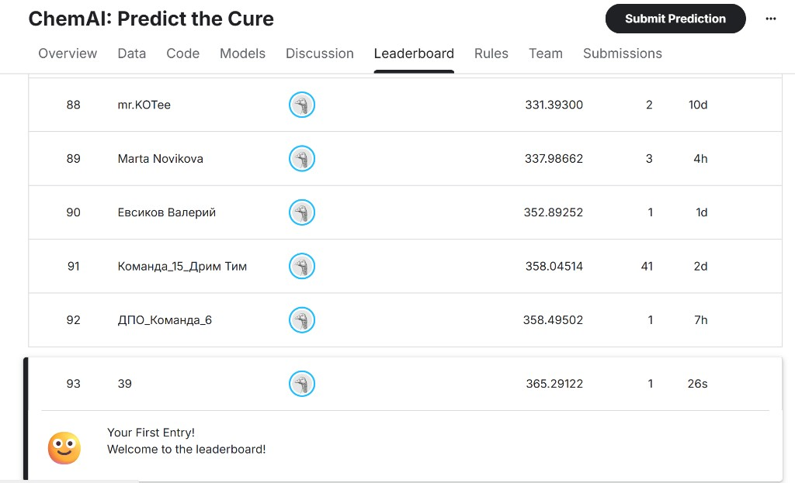

# 39 ChemAI: Predict the Cure

Команда фармацевтической разработки ML и Data-инженеров строит модели, предсказывающие **IC50**, **CC50** и **SI** по 214 молекулярным дескрипторам (см. `ТЗ_Хакатон.txt` в `Разработка/подготовка/`).

## Где по ТЗ что лежит и что даёт скриншот

По **`Разработка/подготовка/ТЗ_Хакатон.txt` (§«Итоговые материалы»)** в **Git-репозитории** должны быть: **код решения**, **описание подхода**, **инструкции по воспроизведению результатов**, **презентация проекта** (файлы удобно складывать в **`docs/presentation/`**); отдельно на платформе — **ссылка на видео** (обязательна для топ-10). Файлы сабмита пайплайна пишутся в **`docs/submissions/`** (настраивается через `CHEM_SUBMISSIONS_DIR`).

Явный **скриншот лидерборда в ТЗ не требуется** и каталог под него не задан — это **рекомендованное подтверждение успешной отправки** решения для README. Хранятся:

| Файл | Назначение |
|------|------------|
| **`docs/leaderboard_first_submission.png`** | Скрин ранней отправки (исторический снимок). |
| **`docs/eda/figures/leaderboard_team39_best_score.png`** | Актуальный фрагмент лидерборда с **лучшим командным скором 349.30995** на момент снимка (**ChemAI: Predict the Cure**, команда **«39»**, ранг **90** по отображению платформы). |

### Лидерборд: лучший зафиксированный результат (команда «39»)

На снимке `docs/eda/figures/leaderboard_team39_best_score.png`: соревнование **ChemAI: Predict the Cure**, публичный **best score команды ≈349.30995** (соответствует авторским CSV `submission2_a4.csv`/`submission3_a4.csv`; см. **`docs/eda/Итоговая_аналитическая_записка_Predict_the_Cure.md`**). Платформа отдельно сообщает, что последняя отправка со скором **373.03730** **не улучшает** лучший результат (варианты с GroupKFold / Optuna из той же серии экспериментов).


### Лидерборд: первый сабмит команды «39» (архив скрина)



*Ранги и метрики на скринах — состояние на момент снимка; после новых отправок они меняются.*

## Требования

- Python **3.11+** (для Windows 11 рекомендуется **3.12+**)
- Файлы соревнования: `ml/data/train.csv`, `ml/data/test.csv` (и опционально `ml/data/sample_submission.csv`)

<a id="data-csv-local"></a>

## Данные: куда положить `train.csv` и `test.csv`

Чтобы программа запускалась без ошибок загрузки, скопируйте выдачу соревнования в **каталог `ml/data/`** в корне репозитория (рядом с `ml/data/.gitkeep`):

| Что добавить | Имя файла | Обязательно |
|--------------|-----------|-------------|
| обучающая выборка | **`train.csv`** | да, для `--train` |
| тестовая выборка | **`test.csv`** | да, для `--predict` |
| образец отправки | `sample_submission.csv` | нет, только подсказка по формату ответа |

Имена **`train.csv`** и **`test.csv`** фиксированы в коде (`ml/src/chemai/utils/data_loader.py`); другие имена без смены `CHEM_DATA_DIR` и правок кода не подхватятся.

Файлы **не коммитятся**: в `.gitignore` указано **`ml/data/*.csv`**, чтобы большие CSV не попадали в git. После `git clone` на другой машине данные нужно **скопировать в `ml/data/` снова** на этой машине.

Проверка из корня репозитория:

```powershell
Test-Path .\ml\data\train.csv
Test-Path .\ml\data\test.csv
```

Открыть папку в проводнике (удобно перетащить файлы):

```powershell
explorer.exe .\ml\data
```

---

## Пошаговый план запуска (терминал)

**Как читать пути.** Абсолютный путь к клону проекта в примерах **не используется**. Рабочая точка — **корень репозитория**: там лежат `run_pipeline.py`, `pyproject.toml`, каталог `ml/` (данные, модели, исходники пакета `chemai` внутри **`ml/src/`**). Добраться до него можно из проводника (меню «Открыть в терминале») или поднимаясь вверх командой **`..`** (один уровень вверх) и затем заходя в нужную папку.

Ниже примеры для **PowerShell** (Windows). Из корня репозитория путь к данным — относительный: `.\ml\data\train.csv`.

### Шаг 1. Открыть терминал в корне репозитория

Если вы уже внутри вложенной папки проекта (например `.\Разработка`), поднимитесь и перейдите в корень:

```powershell
Set-Location ..
```

Повторяйте `Set-Location ..`, пока в текущей папке не появятся файлы `run_pipeline.py` и `pyproject.toml` (или выполните `Get-ChildItem` и проверьте наличие этих файлов).

При необходимости после серии `..` зайдите в папку с проектом (имя папки на вашей машине):

```powershell
Set-Location .\имя_папки_репозитория
```

### Шаг 2. Создать виртуальное окружение

```powershell
py -3.12 -m venv .venv
```

(Если установлен другой интерпретатор: `py -3.11 -m venv .venv`.)

### Шаг 3. Активировать окружение

```powershell
.\.venv\Scripts\Activate.ps1
```

Если срабатывает политика выполнения скриптов, один раз для профиля пользователя:

```powershell
Set-ExecutionPolicy -ExecutionPolicy RemoteSigned -Scope CurrentUser
```

### Шаг 4. Установить зависимости (editable + dev)

```powershell
python -m pip install --upgrade pip
pip install -e ".[dev]"
```

Опционально **CatBoost** (десятый кандидат в ансамбле):

```powershell
pip install -e ".[dev,catboost]"
```

### Шаг 5. Подготовить данные

Убедитесь, что в **`ml/data`** лежат **`train.csv`** и **`test.csv`** (подробности — раздел [«Данные»](#data-csv-local) выше):

```powershell
Test-Path .\ml\data\train.csv
Test-Path .\ml\data\test.csv
```

Должно вывестись `True` для обоих.

### Шаг 6. (Опционально) Конфиг через `.env`

```powershell
Copy-Item .env.example .env
```

Отредактируйте `.env`: `CHEM_DATA_DIR`, `CHEM_MODELS_DIR`, `CHEM_SUBMISSIONS_DIR`, при необходимости `CHEM_N_FOLDS`, `CHEM_N_CLUSTERS`.

Запуск с явным файлом окружения:

```powershell
python run_pipeline.py --train --config .env
```

### Шаг 7. Обучение

```powershell
python run_pipeline.py --train
```

Артефакты: `ml/models_saved/preprocessor.joblib`, `ml/models_saved/pipeline_bundle.joblib`, `ml/models_saved/metrics.json`.

### Шаг 8. Предсказание и submission

```powershell
python run_pipeline.py --predict
```

Результат: `docs/submissions/final_submission.csv` с колонками `index,IC50,CC50,SI`.

### Шаг 9. Проверка кода (после изменений)

```powershell
ruff check ml/src tests run_pipeline.py tools
pytest -q
```

### Тот же поток в одной строке для bash / macOS / Linux

Из корня репозитория (перейдите туда через `cd` и при необходимости `cd ..`):

```bash
python3 -m venv .venv
source .venv/bin/activate
pip install -e ".[dev]"
python run_pipeline.py --train
python run_pipeline.py --predict
```

---

## Установка (кратко)

```bash
python -m venv .venv
# Windows: .venv\Scripts\activate
pip install -e ".[dev]"
```

С [`uv`](https://github.com/astral-sh/uv):

```bash
uv venv
uv pip install -e ".[dev]"
```

## Модели (ансамбль)

На каждый таргет обучаются **не менее девяти** различных типов регрессоров; для IC50/CC50/SI **отдельно** задокументирована применимость (`Разработка/Эпики/Анализ_модельных_вариантов.md`), **веса** в ансамбле считаются по CV **независимо для каждого таргета**. Состав: LightGBM, XGBoost, RidgeCV, ElasticNetCV, HistGradientBoosting, RandomForest, ExtraTrees, GradientBoosting (sklearn), BayesianRidge; при установленном пакете — **CatBoost** (`pip install -e ".[dev,catboost]"`).

## EDA (разведочный анализ данных)

Отчёт с таблицами и графиками: **`docs/eda/EDA_Report.md`** (рисунки в `docs/eda/figures/`). Экспертная аналитика по архитектуре моделей и улучшению метрик — **`docs/eda/Аналитическая_записка_архитектура_моделей.md`**. Итоговая сводка по датасету, EDA, экспериментам, лучшему публичному скору и выбору модели — **`docs/eda/Итоговая_аналитическая_записка_Predict_the_Cure.md`** (скрин лидерборда в этом же каталоге, `figures/leaderboard_team39_best_score.png`).

Пересборка отчёта EDA после обновления CSV:

```bash
uv pip install -e ".[dev]"
uv run python tools/eda_generate_report.py
```

## Конфигурация

Скопируйте `.env.example` в `.env` и при необходимости измените пути (`CHEM_DATA_DIR`, `CHEM_MODELS_DIR`, `CHEM_SUBMISSIONS_DIR`) и `CHEM_N_FOLDS`, `CHEM_N_CLUSTERS`.

## Качество кода

```bash
ruff check ml/src tests run_pipeline.py tools
pytest -q
```

## План и эпики

См. `Разработка/Эпики/Эпики_и_план_реализации.md`, принципы ревью — `ПРИНЦИПЫ_РЕВЬЮ_и_перенос_на_ChemAI.md`, ИБ — `ИБ_анализ.md`.

## Метрика соревнования

`score = (RMSE(IC50) + RMSE(CC50) + RMSE(SI)) / 3`.
