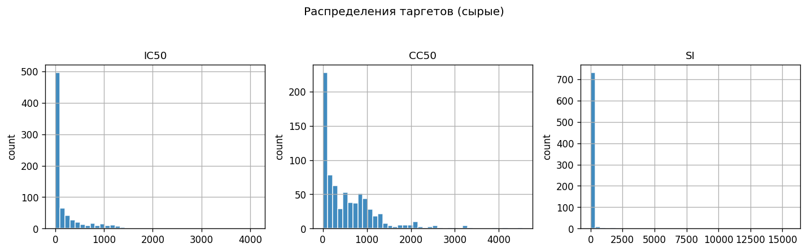
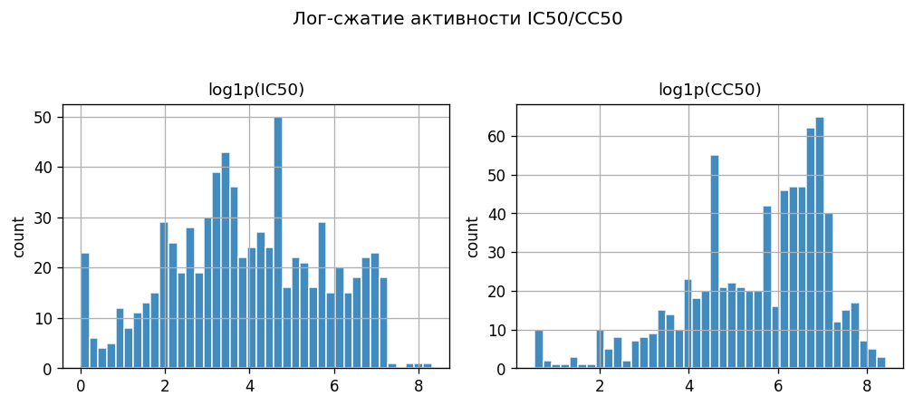
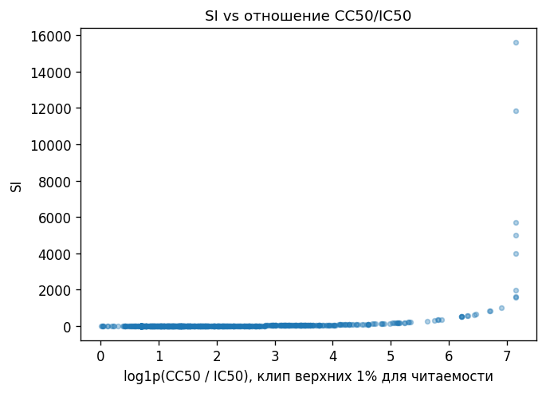
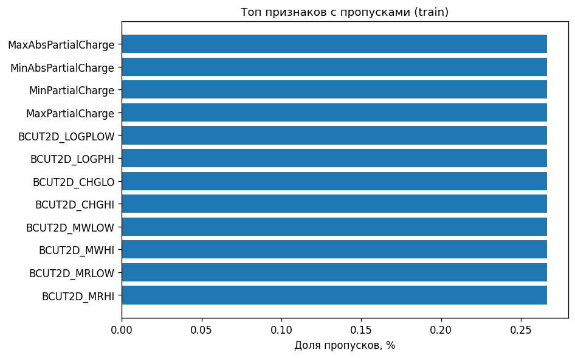
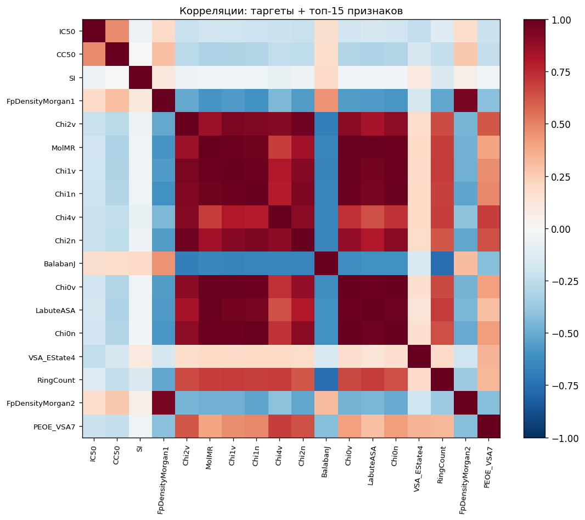
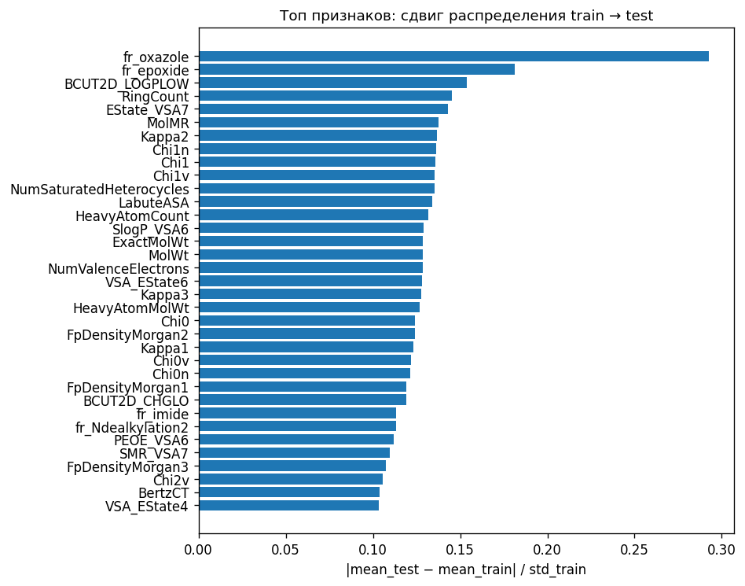

# Exploratory Data Analysis — ChemAI: Predict the Cure
Отчёт ранее мог пересоздаваться скриптом из репозитория разработчиков (снимок сохранён в git); при необходимости после обновления CSV правьте вручную этот файл и `figures/`.
## 1. Объём и целостность данных
| Набор | Строки | Колонки | Комментарий |
|---|---|---|---|
| train | 751 | 214 | включает `index`, три таргета, 210 числовых признаков |
| test | 250 | 211 | `index` + те же признаки что в train |
| Совпадение имён признаков train/test | **да** | — | симметричная разность пустая |
| Дубликаты строк по 210 признакам (train) | **121** | ~16.1% объектов |
| Константные признаки (variance≤0 или нечисловая дисперсия) | **18** | — | |

## 2. Целевые переменные (IC50, CC50, SI)
| target | n | missing | min | median | mean | max | std | skew |
|---|---|---|---|---|---|---|---|---|
| IC50 | 751 | 0 | 0.00351669 | 44.0693 | 204.544 | 4095.19 | 370.121 | 3.79 |
| CC50 | 751 | 0 | 0.700808 | 376.581 | 577.426 | 4538.98 | 641.088 | 2.06 |
| SI | 751 | 0 | 0.0114893 | 4 | 89.1533 | 15620.6 | 788.357 | 15.6 |

Наблюдения:
- **IC50/CC50**: **асимметрия вправо** (skew ≫ 2) — лог-преобразование `log1p` смягчает шкалу и совпадает с решением пайплайна.
- **SI**: высокая асимметрия (skew велик); при этом при проверке **на train выполняется тождество** `SI = CC50 / IC50` с max $|SI - CC50/IC50| \approx 2.001e-11$.

### Матрица корреляций: таргеты и отношение CC50/IC50
|  | IC50 | CC50 | SI | CC50/IC50 |
|---|---|---|---|---|
| IC50 | 1.0000 | 0.4704 | -0.0605 | -0.0605 |
| CC50 | 0.4704 | 1.0000 | -0.0057 | -0.0057 |
| SI | -0.0605 | -0.0057 | 1.0000 | 1.0000 |
| CC50/IC50 | -0.0605 | -0.0057 | 1.0000 | 1.0000 |
- На **`test`** метки SI недоступны; в сабмите по регламенту платформы всё равно нужно выдать **три столбца**. Практический вариант: обучаться по факту на `SI`, либо **согласовывать** предсказания `IC50/CC50/SI`, например задавая SI как функцию двух первых после инференса — но это уже инженерный выбор, не условие EDA.

## 3. Пропуски и «плоские» признаки
- Колонок с пропусками в train: **12**

Топ по доле NA:
| feature | pct_missing |
|---|---|
| MaxAbsPartialCharge | 0.2663% |
| MinAbsPartialCharge | 0.2663% |
| MinPartialCharge | 0.2663% |
| MaxPartialCharge | 0.2663% |
| BCUT2D_LOGPLOW | 0.2663% |
| BCUT2D_LOGPHI | 0.2663% |
| BCUT2D_CHGLO | 0.2663% |
| BCUT2D_CHGHI | 0.2663% |
| BCUT2D_MWLOW | 0.2663% |
| BCUT2D_MWHI | 0.2663% |
| BCUT2D_MRLOW | 0.2663% |
| BCUT2D_MRHI | 0.2663% |

Признаки с числом **уникальных значений ≤2** в train (примерно константы/бинари с редкой меткой): **49**

| feature | nunique |
|---|---|
| NumRadicalElectrons | 1 |
| SMR_VSA8 | 1 |
| SlogP_VSA9 | 1 |
| fr_N_O | 1 |
| fr_SH | 1 |
| fr_benzodiazepine | 1 |
| fr_barbitur | 1 |
| fr_azide | 1 |
| fr_isocyan | 1 |
| fr_isothiocyan | 1 |
| fr_lactam | 1 |
| fr_dihydropyridine | 1 |
| fr_diazo | 1 |
| fr_phos_ester | 1 |
| fr_prisulfonamd | 1 |
| fr_nitroso | 1 |
| fr_phos_acid | 1 |
| fr_thiocyan | 1 |
| fr_aldehyde | 2 |
| fr_alkyl_carbamate | 2 |
| fr_amidine | 2 |
| fr_HOCCN | 2 |
| fr_COO | 2 |
| fr_COO2 | 2 |
| fr_guanido | 2 |

## 4. Функциональные группы `fr_*`
- Всего `fr_*` колонок: **85**.
- В RDKit-дескрипторах столбцы `fr_*` — как правило **счётчики** наличий/повторений фрагментов (могут принимать целые значения > 1), поэтому «доля наличия» интерпретируется как среднее значение, а не только {0,1}.

Наибольшая средняя «частота» фрагмента (может подсказывать редкий сигнал):
| fr_* feature | mean(train) |
|---|---|
| fr_bicyclic | 1.4261 |
| fr_NH0 | 1.3209 |
| fr_ether | 1.0266 |
| fr_benzene | 0.9867 |
| fr_C_O | 0.8256 |
| fr_C_O_noCOO | 0.7643 |
| fr_halogen | 0.6352 |
| fr_Ar_N | 0.5819 |
| fr_Al_OH | 0.4115 |
| fr_NH1 | 0.3981 |
| fr_alkyl_halide | 0.3981 |
| fr_amide | 0.3555 |
| fr_allylic_oxid | 0.3342 |
| fr_Al_OH_noTert | 0.3169 |
| fr_aniline | 0.3103 |

## 5. Линейные связи признаков с таргетами (Pearson |corr|)
Таблицы: топ-10 по каждому таргету (NaN в признаках заполнены **медианой выборки только для этого ранжирования**).

### IC50
| rank | feature | |corr| |
|:---:|:---|:---:|
| 1 | VSA_EState4 | 0.2450 |
| 2 | Chi2n | 0.2249 |
| 3 | Chi2v | 0.2204 |
| 4 | PEOE_VSA7 | 0.2175 |
| 5 | Chi4v | 0.2142 |
| 6 | Chi4n | 0.2118 |
| 7 | Chi3v | 0.2114 |
| 8 | Chi3n | 0.2111 |
| 9 | SlogP_VSA5 | 0.2051 |
| 10 | Chi1n | 0.2050 |

### CC50
| rank | feature | |corr| |
|:---:|:---|:---:|
| 1 | LabuteASA | 0.3066 |
| 2 | MolMR | 0.3066 |
| 3 | Chi0 | 0.3051 |
| 4 | MolWt | 0.3050 |
| 5 | ExactMolWt | 0.3050 |
| 6 | Kappa1 | 0.3048 |
| 7 | HeavyAtomCount | 0.3038 |
| 8 | Kappa2 | 0.3028 |
| 9 | Chi1 | 0.3024 |
| 10 | NumValenceElectrons | 0.3023 |

### SI
| rank | feature | |corr| |
|:---:|:---|:---:|
| 1 | BalabanJ | 0.1882 |
| 2 | fr_NH2 | 0.1763 |
| 3 | RingCount | 0.1417 |
| 4 | fr_Al_COO | 0.1128 |
| 5 | fr_COO2 | 0.1110 |
| 6 | fr_COO | 0.1110 |
| 7 | FpDensityMorgan1 | 0.1028 |
| 8 | VSA_EState4 | 0.0988 |
| 9 | NumAromaticRings | 0.0976 |
| 10 | VSA_EState6 | 0.0931 |

## 6. Сдвиг распределений train ↔ test
Эвристика для каждого признака: отношение |среднее_test − среднее_train| к std_train по train. Большие значения намекают на возможный covariate shift между выборками.

Топ-15:
| feature | shift_score |
|:---|:---:|
| fr_oxazole | 0.2926 |
| fr_epoxide | 0.1812 |
| BCUT2D_LOGPLOW | 0.1539 |
| RingCount | 0.1451 |
| EState_VSA7 | 0.1429 |
| MolMR | 0.1376 |
| Kappa2 | 0.1369 |
| Chi1n | 0.1360 |
| Chi1 | 0.1356 |
| Chi1v | 0.1354 |
| NumSaturatedHeterocycles | 0.1353 |
| LabuteASA | 0.1341 |
| HeavyAtomCount | 0.1316 |
| SlogP_VSA6 | 0.1291 |
| ExactMolWt | 0.1287 |

## 7. Выводы и рекомендации для моделирования
- **Предобработка:** есть редкие пропуски (заряды BCUT*) — нужны заполнение + масштабирование; **18 констант** и множество «плоских» колонок (≤2 различных значений в train) желательно либо убрать, либо не усиливать в линейных моделях.
- **IC50/CC50:** тяжёлые правые хвосты → `log1p` по IC50/CC50 уместен.
- **SI на train совпадает с CC50/IC50** (max остаток ≈ `2.001e-11`). Для финального файла платформе всё равно нужен столбец SI — стоит обсудить **согласованность** его с предсказанными IC50/CC50.
- Много дубликатов по вектору признаков (см. §1): при CV учитывать утечку «соседа» между фолдами по желанию; кластерный CV частично с этим уже помогает.
- **Train vs test:** смотреть топ сдвига средних (§6): при сильном shift ансамбли и деревья обычно устойчивее простых линейных методов без регуляризации.
- `fr_*` — целочисленные счётчики / индексы фрагментов → хорошо улавливаются **деревьями**, при линейных моделях полезно квантировать или использовать регуляризацию.

Экспертная аналитика по выбору моделей и путям улучшения: **[Аналитическая_записка_архитектура_моделей.md](Аналитическая_записка_архитектура_моделей.md)**.
