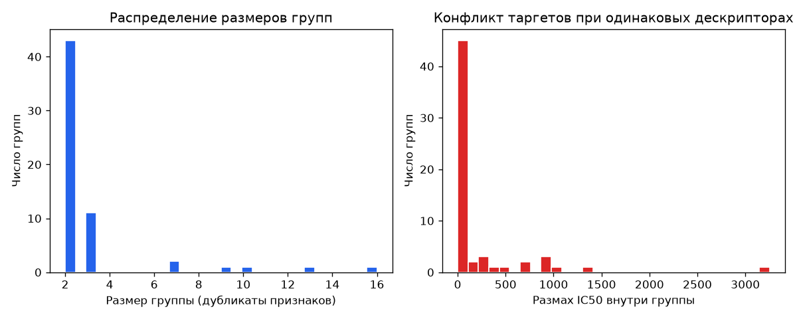

# Отчёт: группы дубликатов признаков (Фаза 0)

**Подготовка:** Артур Сидоров
**Контекст:** ChemAI Predict the Cure, train.csv

## Сводка

| Показатель | Значение |
|------------|----------|
| Строк train | 751 |
| Уникальных групп признаков | 630 |
| Строк в группах size>1 | 181 (24.1%) |
| Групп с >1 строкой | 60 |
| max \|SI − CC50/IC50\| на train | 2.001e-11 |

## Конфликт таргетов внутри групп

| Таргет | Групп с разбросом >1e-6 | Медиана отн. разброса | Max отн. разброс |
|--------|-------------------------|----------------------|------------------|
| IC50 | 49 | 1.0327 | 5.2646 |
| CC50 | 43 | 0.4898 | 7.4487 |
| SI | 53 | 0.9160 | 10.6233 |

## Интерпретация

- Одинаковый вектор RDKit-дескрипторов **не гарантирует** одинаковые IC50/CC50/SI — это label noise / скрытые факторы (сольват, протокол, стереоизомер не в таблице).
- GroupKFold «в лоб» может **ухудшить LB** при другом смешении test — см. историю submission4.
- Для Фазы 1: веса `1/√(размер группы)` и robust loss предпочтительнее жёсткого group split.

