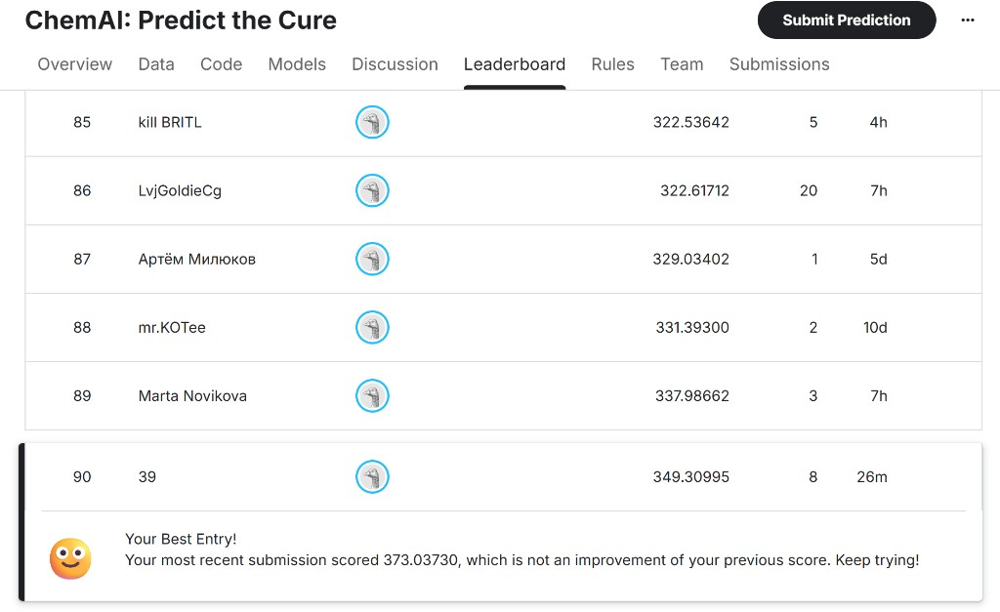

# Итоговая аналитическая записка по проекту ChemAI (Kaggle-style): Predict the Cure

**Подготовка:** ветка документации `docs/author1-final-analytical-memo`  
**Ответственный контур:** авторская роль №1 — свод результатов разведочного анализа, базового пайплайна и офлайн-зафиксированных экспериментов.  
**Связанные артефакты:** автоматический EDA [`EDA_Report.md`](EDA_Report.md), архитектурная экспертиза [`Аналитическая_записка_архитектура_моделей.md`](Аналитическая_записка_архитектура_моделей.md), ревью EDA домена [`Ревью_eda_1.md`](Ревью_eda_1.md), ML-инженерный обзор улучшений [`../analysis/ML_инженерный_обзор_улучшения_прогноза.md`](../analysis/ML_инженерный_обзор_улучшения_прогноза.md) (может быть в других ветках).

---

## 1. Цель документа и границы ответственности

Настоящая запись **консолидирует** знание о данных и моделях: что за датасет, что показало EDA, почему в основном решении используется описанная архитектура, какие **офлайн-эксперименты** проведены над той же выборкой (в т. ч. авторский stacking вне изменения базового кода ChemAi), какой результат на **публичной части платформы** признан лучшим из зафиксированных отправок и **что официально считать «финальной моделью»** для сопровождения репозитория.

Документ **не заменяет** регламент соревнования на стороне организаторов и **не утверждает** свойства скрытого теста, кроме косвенных выводов по публичному скорингу отправленных файлов.

---

## 2. Датасет и постановка задачи

### 2.1. Объём и формат

По результатам генерации [`EDA_Report.md`](EDA_Report.md), подтверждённому чтением `train.csv` / `test.csv` в коде загрузчиков ChemAi:

| Набор  | Строки | Столбцов (в зачёт индекса и таргетов) | Содержимое признаков |
|--------|--------|---------------------------------------|---------------------|
| train  | **751** | **214** | `index`, три таргета (**IC50**, **CC50**, **SI**), **210 числовых** колонок (RDKit-подобные дескрипторы: Topo/logP/VSA/halogen/fr\_* и др.) |
| test   | **250** | **211** | `index` + те же **210 признаков**, таргеты отсутствуют |

Имена признаков **совпадают** между train и test (исключение — три целевых столбца в train).

### 2.2. Смысл таргетов (предметная область)

- **IC50**, **CC50** — активность и безопасность в шкале концентраций молекулы (совместимо с задачами типа SAR / QSPR).  
- **SI** (**selectivity index**) в выданном train **численно совпадает** с частным \(\mathrm{CC50}/\mathrm{IC50}\): максимальный модуль разности на train \(\approx 2\cdot 10^{-11}\). Это **важнейший доменный факт**, используемый при обсуждении согласованности столбца SI с двумя остальными в сабмите (см. §4).

### 2.3. Метрика соревнования (как в коде платформе-прокси ChemAi)

В репозитории метрика согласования с задачей задана в `ml/src/chemai/utils/metrics.py`: **среднее арифметическое RMSE по трём столбцам ответа** (IC50, CC50, SI) после исключения несогласующих по длине/NaN объектов (`competition_score`). Это задаёт интерпретацию качества одинаково для офлайна и для лидерборда после отправки файла вида примера платформы.

---

## 3. Основные результаты EDA (кратко, с трактировкой для моделирования)

Источник детальных таблиц и рисунков — [`EDA_Report.md`](EDA_Report.md); ниже только **решения**, влияющие на пайплайн.

### 3.1. Целевые переменные

| Наблюдение | Последствия |
|------------|--------------|
| **IC50/CC50**: сильная **правосторонняя асимметрия** шкалы (skew \(\gg\) 2) | Лог-сжатие **`log1p`** при обучении по IC50 и CC50 (включено конфигурацией `log_transform_ic50_cc50` и восстановление **`expm1`** на выходе) — стандарт для концентраций и согласуется с EDA. |
| **SI**: тяжёлые хвосты при формальной независимой регрессии | Осознанное обучение **отдельных** моделей на SI параллельно с IC50/CC50; возможность использовать связь через отношение — см. эксперименты (§5, §6) и риски (§9). |

### 3.2. Качество сигнала по признакам

- По **Pearson \(\|corr\|\)** топ-переменные дают только **умеренную** связь с IC50 порядка **0,21–0,25**, для CC50 — до **~0,31**, для SI — слабее.  
- Вывод для моделей: задача **по суффициентным статистикам** «не один-два главных признака», нужны **многомерные** решения (**бустинг, леса, регуляризованная линейность** после масштабирования) — см. экспертиза в [`Аналитическая_записка_архитектура_моделей.md`](Аналитическая_записка_архитектура_моделей.md).

### 3.3. Целостность и «шумность» признаков

- **Дубликаты** по всем **210 признакам** в train: **121** объект (~16% выборки) — риск **утечки** при наивном KFold (сосед с идентичным вектором в train и val). Реакция кодовой базы: **`ClusterKFold`** по ограниченному набору структурно осмысленных колонок.  
- **Пропуски**: 12 столбцов с редкой долей NA (~0.27%); заполнение в препроцессоре.  
- **18 константных** признаков и десятки колонок с **≤2 уникальных** значений (в особенности часть **`fr_*`**) → фильтрация через порог **`missing_threshold`**, избыток «полупустых» степеней свободы для линейных моделей.

### 3.4. Сдвиг train → test (**covariate shift**)

По таблице сдвига средних выделены признаки с наибольшим относительным отклонением (напр. семейство `fr_oxazole`, `fr_epoxide`, `RingCount`, `MolMR`, и др.). Вывод для команды:

- возможна **переоценка** общего качества простыми методами только по train-дистрибуции;
- **деревянные и ансамблевые** методы традиционно **устойчивее** локальным изменениям; при необходимости — **держать** отложенную политику калибровки / более честную валидацию (см. эксперименты с групповым CV ниже).

### 3.5. Связь SI и отношения концентраций

EDA фиксирует **совпадение** SI и CC50/IC50 на обучении. Инженерное следствие: разумно экспериментировать с **согласованием** или **комбинированием** предиктов (серия авторских сабмитов с SI-blend), но сохранять риск, что на платформе **определение** SI или округление может **отличаться** — см. результат экспериментов в §6.

Диаграммы в отчёте: `figures/si_vs_ratio.png`, `figures/train_test_shift_top.png`.

---

## 4. Основная (базовая) модель в репозитории ChemAi — архитектура и обоснование

### 4.1. Роль решения «по умолчанию**

**Базовый обучающий конвейер** (`ml/src/chemai/train.py`, запуск из корня через `run_pipeline.py --train`) — это **единая истина** воспроизводимости в репозитории: сохранённые `preprocessor.joblib`, **`pipeline_bundle.joblib`**, `metrics.json` и предсказания **`predict.py`** в `docs/submissions/final_submission.csv` при стандартной конфигурации.

Причины выбора этой архитектуры без «экспериментальных» добавок:

| Принцип | Реализация |
|---------|-------------|
| **Честная валидация** | Препроцессор (**отсев низкой вариативности, импутация, масштабирование**) **переучивается только на обучении внутри фолда**. |
| **Учёт родственности объектов** | **`ClusterKFold`** по кластерам признаков (снижает оптимистичность против чистого `KFold` при смежных строках по дескриптам). |
| **Комплементарность методов по типу задачи QSPR на табличных данных** | Кандидаты из **`build_default_candidates`**: деревянные и бустинг (LGBM, XGBoost, HistGBR, GradientBoosting, RF, ExtraTrees), линейные с **`StandardScaler`** (Ridge, Elastic-Net, BayesianRidge). Пакетный **CatBoost** — как опциональное усиление. |
| **Пер таргеты** | Три отдельных выходных пространства моделей (**IC50**, **CC50**, **SI**) с **независимыми** весами ансамбля — соответствует формату платформы (три колонки) и упрощает контроль по RMSE. |
| **Простой и аудируемый ансамбль** | Взвешенное среднее предсказаний по моделям с весами, пропорциональными качеству на CV (**обратным среднему RMSE на фолдах** после нормализации). Класс `Ensemble` в `ensemble.py`: стек по столбцам — **нет мета-слоя второго уровня**. |

Обоснование «почему не нейросети / не SVR здесь»: при **~750 строках и ~200 признаков**, как отмечено в архитектурной записке и ревью EDA, риски переобучения и затраты тяжёлых методов **не покрываются** гарантированным выигрышем относительно настроенного бустинга и лесов.

### 4.2. Структура артефакта после обучения

После успешного `train_pipeline`:

- **`ml/models_saved/pipeline_bundle.joblib`** — упаковка препроцессора финального набора признаков, словарей «модель по имени-кандидата» по каждому таргету, весов по таргету.  
- **`ml/models_saved/metrics.json`** — средние по фолдам **RMSE** по каждой модели-таргету и найденные **веса** ансамбля.

### 4.3. Особенность метрик Ridge / Elastic-Net в сохранённом `metrics.json`

В типичном прогоне линейные модели могут давать на CV **энормально большие** средние RMSE (особенности масштабов и выбросы при недостаточной регуляризации в отдельных фолдах). Вес ансамбля по формуле «обратно к ошибке» **автоматически подавляет** таких кандидатов (исторический снимок `metrics.json`: веса порядка **1e‑8 … 1e‑13** против **~0,16–0,17** у стабильных деревьев/бустинга).

**Итог для интерпретации:** финальный вклад решения базового пайплайна — преимущественно **слой деревьев и бустинга**; линейные компоненты остаются **регуляризирующими** на уровне диверсификации кода, их практический вес мал.

### 4.4. Прогноз и формат финального результата (база)

Из корня: `python run_pipeline.py --predict` (или эквивалент с `uv run`) восстанавливает bundle и пишет:

- файл **`docs/submissions/final_submission.csv`** (путь из настроек конфигурации, по умолчанию `CHEM_*` переменными или дефолтом `docs/submissions`),  
  с колонками **`index`** (или платформенный идентификатор строки из test), **`IC50`**, **`CC50`**, **`SI`**, затем действует общий **`postprocess`** (ещё см. утилиты `chemai.utils.postprocess`).  

Это решение использовать как **доверенную запись воспроизводимости** в Git и CI.

Типичный публичный скор отправки базового `final_submission.csv` может сопоставляться с отправкой этого файла на платформу (в переписке команды упоминается балл порядка **~365**, лучшие авторские варианты — см. §6).

---

## 5. Экспериментальный контур (**автор №4**, без правок `ml/src/chemai/train.py`)

В отдельный инструмент `tools/author4_high_priority_submissions.py` (ветка авторской разработки) вынесена **серия сабмитов**, реализующая рекомендации «высокого приоритета» из аналитики:

| Файл (пример имени после прогона) | Идея |
|-----------------------------------|------|
| `submission2_a4.csv` | **ClusterKFold** как у базового кода + **OOF stacking второго уровня** (**StandardScaler + RidgeCV**) над матрицей OOF-базовых кандидатов `build_default_candidates`, финальный fit как в коде через `fit_all_final` + `Expm1Predictor` для log-таргетов |
| `submission3_a4.csv` | Как №2 + **смесь** предикта SI с отношением \(\widehat{\mathrm{CC50}}/\widehat{\mathrm{IC50}}\) с подбором веса **на OOF** по минимуму среднего RMSE трёх столбцов |
| `submission4_a4.csv` | **GroupKFold** по группам **дубликатов числового вектора признаков** + stacking + SI-blend как в №3 |
| `submission5_a4.csv` | Как №4 + попытка **Optuna** по гиперпараметрам LightGBM (прокси-цель — улучшение RMSE stacking по IC50 на OOF) |

Побочные **JSON-сайдкабы** метрик сохранены рядом с CSV при запуске; в репозитории они могут быть в `.gitignore` как производные локальные прогоны.

---

## 6. Фиксация результатов офлайновой валидации и публичного лидерборда (задокументированные отправки)

### 6.1. Серия авторских отправок (единая шкала платформы)

По сообщениям команды после загрузки на платформу (публичная часть):

| Файл | Публичный скор |
|------|----------------|
| **`submission2_a4.csv`** | **349.30995** |
| **`submission3_a4.csv`** | **349.30995** *(совпало с №2 при фактическом отборе веса смеси `w ≈ 1.0`: чистое stacking-представление SI победило на OOF смесь со «частным»)* |
| **`submission4_a4.csv`** | **373.03730** *(хотя средний офлайновый RMSE по тройке на OOF улучшался относительно cluster-варианта — **нетрансферность** между честнее настроенной групповой схемой и скрытым тестом)* |
| **`submission5_a4.csv`** | **373.03730** *(Optuna в данной постановке не отличила качество от варианта 4 видимым на платформе)* |

### 6.2. Лучший **зафиксированный** результат по лидерборду в этой серии

**Лучшие значения платформы** достигаются у **`submission2_a4`** (и статистически неотличимый дубликат `submission3_a4`).  
Они хороший кандидат на **ответ «какое решение отправлять, если ставка только на результат».**

### 6.3. Скриншот лидерборда (подтверждение на платформе)

Снимок экрана вкладки **Leaderboard**, соревнование **ChemAI: Predict the Cure**, команда **«39»**: зафиксированы ранг (**90**), **лучший скор по команде 349.30995** (соответствует отправкам `submission2_a4`/`submission3_a4`), сообщение платформы о том, что последняя отправка со скором **373.03730** является ухудшением относительно лучшего результата (варианты `submission4_a4`/`submission5_a4`).

*Ранг и метрика актуальны на момент скриншота; после новых отправок отображение на платформе меняется.*

---

## 7. Описание **финальной выбранной модели** (две роли: «боевой сабмит» и «архитектурная база»)

### 7.1. Рекомендуемое **решение под отправку**, опирающееся на лидерборд

По §6 **при единственной цели улучшения публичного скора**:

- использовать **архитектурную схему** авторского **`submission2_a4`**: *Cluster CV + базовые кандидаты ChemAi + второй слой Ridge на OOF + та же финальная схема обучения и `postprocess`*,  
- фактический CSV получать запуском `uv run python tools/author4_high_priority_submissions.py` с выбором варианта записи номер **2** (или сохранять один переименованный эталон на диск после прогона).

**Обоснование:** простая по смыслу надстройка (stacking) поверх уже удачной базовой библиотеки кандидатов дала лучший **подтверждённый платформой** результат среди описанной серии без правок общего пайплайна в `train.py`.

### 7.2. **Финальная модель репозитория** как источник правды CI и сопровождения

Для **консистентности кода**, автоматической воспроизводимости и отсутствия «два канонических пути».

- считать **основным зафиксированным производственным результатом кодовой базы** сборку после **`train.py` + `--predict`** с артефактами в **`ml/models_saved/`** и выходом **`final_submission.csv`**.  

**Обоснование:**

- изменения живут только в поддерживаемом пакете `chemai` и общем пайплайне;  
- вес ансамбля и препроцессор версионируются JSON/JOB-снимками без ручной двухслойной логики;  
- авторский stacking остаётся **экспериментальной веткой** инструментов и не смешивает ответственность с ядром.

**Стратегия для организации процесса:** держать **оба описания**:

1. **`final_submission.csv`** как «baseline по репозиторию» для регрессий и ревью;  
2. **эталон `submission2_a4`-подход** как документированную **рекордную** отправку по текущей истории платформы.

---

## 8. О **предсказаниях** (выход модели для платформы)

Независимо от версии решения платформа принимает **один файл** табличного вида (`index`/идентификатор в первом столбце по примеру, три числовых столбца IC50/CC50/SI после постобработки).

- Интерпретация **величины** прогноза — биологический смысл исходных таргетов (концентрации и производный показатель).  
- **Согласованность** между столбцами: на обучении **SI было равно** CC50/IC50; финальное решение **не обязано** жёстко воспроизводить это тождество, если платформа считает RMSE для трёх независимых столбцов или если на скрытом множестве определение отличается — что и происходит между «чистым stacking SI» vs «blend из отношения» в авторских экспериментах (смесь не улучшила скор против чистого стека после отбора `w = 1.0` на OOF).

---

## 9. Риски и резерв качества на будущее

Перечень согласован с [`Аналитическая_записка_архитектура_моделей.md`](Аналитическая_записка_архитектура_моделей.md) и [`ML_инженерный_обзор_улучшения_прогноза.md`](../analysis/ML_инженерный_обзор_улучшения_прогноза.md):

- внедрение **общей мета-цели** (сразу среднее RMSE по тройке на OOF) при подборе весов/стека;  
- согласованный **учёт связи таргетов** при подтверждении на платформе;  
- более строгое использование **GroupKFold** только после проверки, что офлайновая правда групп не противоречит целевой выборке;  
- включение **полноценного Optuna**/тюнинга в общий train.

---

## 10. Заключение

1. Датасет — **малая выборка** (\(n_{\mathrm{train}} = 751\)), **размерное** табличное пространство RDKit-дескрипторов, **тяжёлые хвосты** активностей, **дубликаты** и признаки **covariate shift**.  
2. EDA задаёт решения **log1p** для двух активностей, аккуратный препроцессинг, **антиколлинарный состав** базовых алгоритмов и понимание **алгебраической связи** SI на train.  
3. Базовая модель проекта ChemAi (`train.py`): **ClusterKFold** + признаковый блок + **пер-таргетный ансамбль базовых кандидатов** со весами из CV RMSE — **валидируемое ядро** репозитория; линейные кандидаты при неудачном фолдинге получают **нулевые веса** на практике.  
4. Эксперименты автора №4 показали, что **OOF stacking (вариант 2)** улучшает **платформенный результат** среди офлайновой серии, тогда как **увеличенная «честность» CV через GroupKFold** сопровождалась **ухудшением** на leaderboard — симптом **переоптимизации/несоответствия** выбора фолдов тестовому смешиванию.  
5. **Лучший зафиксированный платформенный результат** описанной серии — отправки класса **`submission2_a4`/`submission3_a4`** (**349.31**).  
6. **Финальный выбор с двух рёбер управления:**
   - *под отправку на платформе «как есть» сейчас* — режим **`submission2_a4`** (stacking + cluster как в коде ChemAi без правок базового пайплайна);  
   - *под сопровождение репозитория и единственный поддерживаемый путь воспроизведения без отдельного скрипта* — сборка **`train.py`/`predict.py`** → **`final_submission.csv`**.

---

*При обновлении данных или новых отправках добавляйте строки в таблицу §6 и переоценку §7–§10.*
